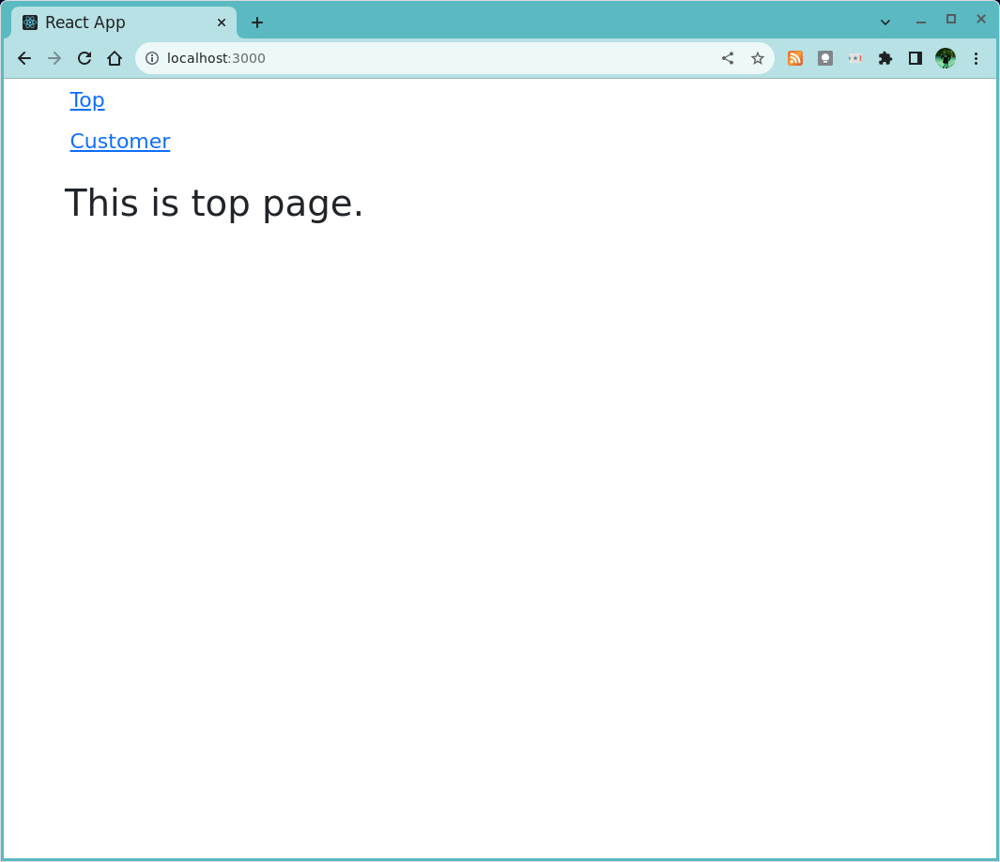

# Example implementations of Sign in with Google using React.js frontend and Django/fastapi backend

This repository provides example app implementations using Google OAuth as the authentication mechanism.
The frontend app is implemented using React.js. 
The backend API servers are implemented in two ways, one is using Django REST framework(DRF) and the other is using fastapi.

The [noauth](noauth) directory contains example apps for React.js+DRF and React.js+fastapi without authentication.

```
noauth/
├── backend-django
├── backend-fastapi
└── frontend
```

The [google-oauth](google-oauth) directory contains example apps for React.js+DRF and React.js+fastapi using Google OAuth as the authentication mechanism.

```
google-oauth/
├── backend-django
├── backend-fastapi
├── frontend-01
└── frontend-02
```

# Sessions

As for maintaining sessions, I implemented the backend API servers so that they set session cookies after [verification of id token](https://developers.google.com/identity/gsi/web/guides/verify-google-id-token) provided by Google.

The authentication follows the following steps:

1. A user visits a restricted page.
1. React.js app redirects the user to the login page.
1. The user authenticates them at the Google OAuth endpoint. Google OAuth API returns an id token as a JSON Web Token(JWT).
1. React.js app receives the JWT from Google and sends it to the backend API servers.
1. The backend API servers verify the id token's signature using Google public certificate and trust the user's information in the payload.
1. The backend API servers create the user if it does not exist in the database and return the user's information while setting a new session cookie in the response header.
1. React.js app regards the user as authenticated and sets a property to always send a request with the session cookie in the following API communications.
1. The backend API servers allow what is allowed for the user as long as the session is valid.

Many examples on the Internet are using JWT access tokens themselves, which are provided by Google or the backend API server.
However, there are arguments that [JWT tokens should not be used for sessions](http://cryto.net/~joepie91/blog/2016/06/13/stop-using-jwt-for-sessions/).
Therefore, the apps in this repository use an auth backend using the native session mechanism of Django or fastapi.

# How the example apps look like

## How the app works without authentication

The app in this repository consists of two pages, "Top" and "Customer."




The Customer page, which fetches the data from the API server, is not restricted. Therefore the page can be seen by unauthenticated users.

##  How the app works with authentication

With authentication implemented, anonymous users' access is redirected to the login page, where they can sign in with their Google account.


The Customer page can only be seen after successful authentication.


Please note that the authentication mechanism protects the Customer page and prevents the React.js frontend app from fetching the data from the API server.

